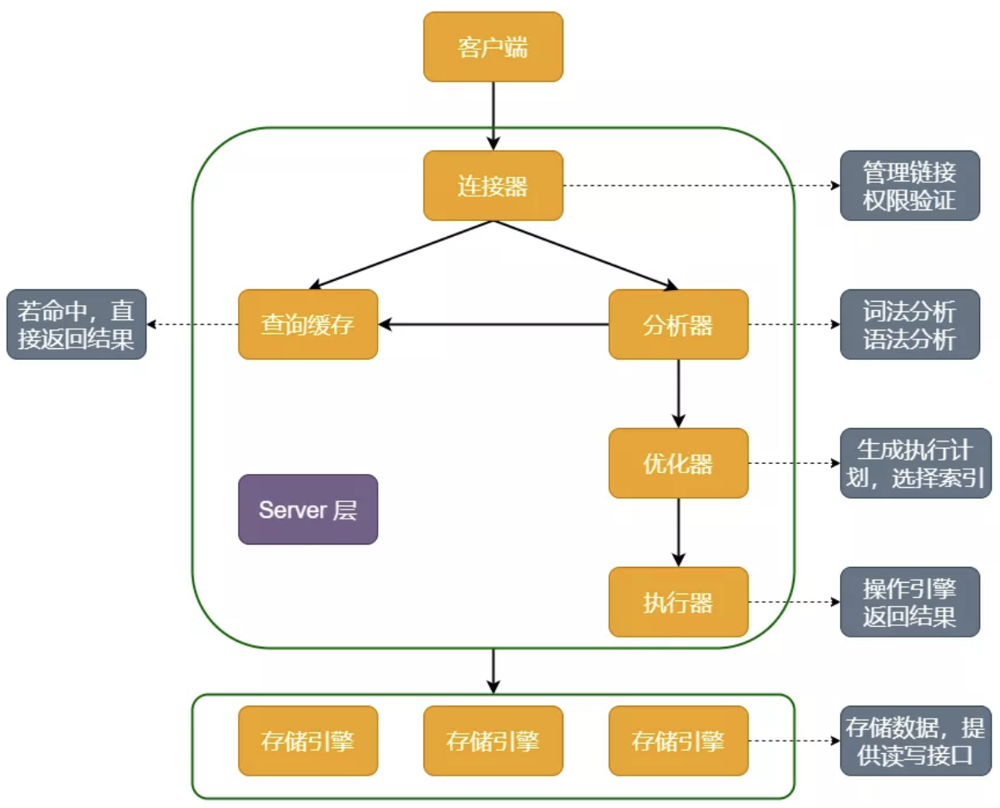
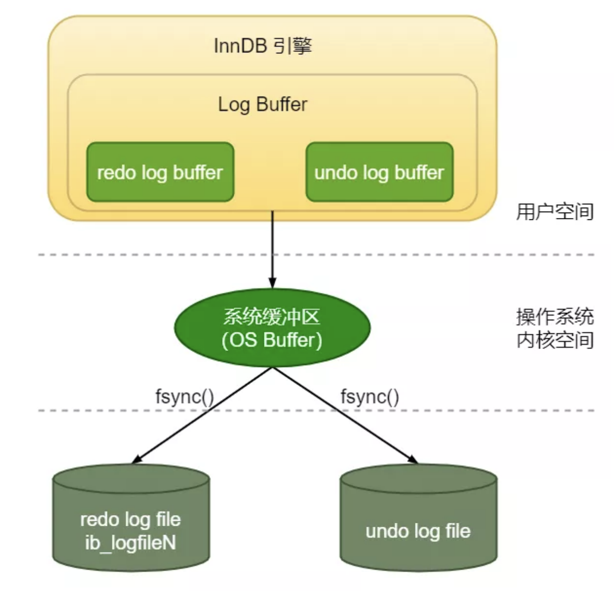
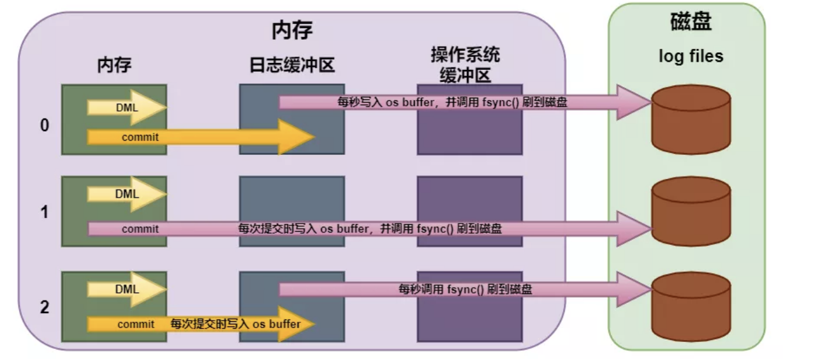
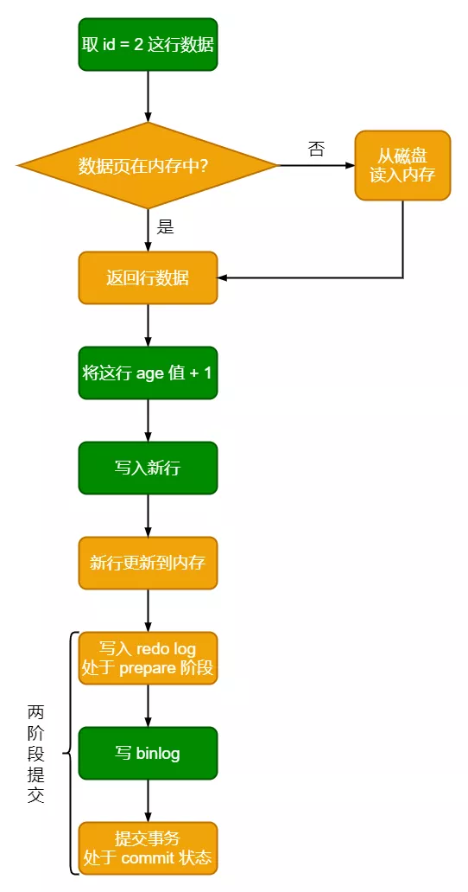

**2.1事务日志：redo log**

同样，在 MySQL 中，如果每一次的更新要写进磁盘，这么做会带来严重的性能问题：

- 因为 Innodb 是以页为单位进行磁盘交互的，而一个事务很可能只修改一个数据页里面的几个字节，这时将完整的数据页刷到磁盘的话，太浪费资源了！
- 一个事务可能涉及修改多个数据页，并且这些数据页在物理上并不连续，使用**随机 IO 写入性能太差**！

为了解决这个问题，MySQL 的设计者就用了类似掌柜粉板的思路来提升更新效率。这种思路在 MySQL 中叫 WAL（Write-Ahead Logging），意思就是：**先写 redo log 日志，后写磁盘**。日志和磁盘就对应上面的粉板和账本。

具体到 MySQL 是这样的：有记录需要更新，InnDB 把记录写到 redo log 中，**并更新内存中的数据页**，此时更新就算完成。同时，后台线程会把操作记录更新异步到磁盘中的数据页。

PS：**当需要更新的数据页在内存中时，就会直接更新内存中的数据页；不在内存中时，在可以使用 change buffer（篇幅有限，这个后面写文章再聊） 的情况下，就会将更新操作记录到 change buffer 中，并将这些操作记录到 redo log 中；如果此时有查询操作，则触发 merge 操作，返回更改后的记录值**。

有些人说 InnoDB 引擎把日志记录写到 redo log 中，redo log 在哪，不也是在磁盘上么？

**对，这也是一个写磁盘的过程，但是与更新过程不一样的是，更新过程是在磁盘上随机 IO，费时。而写 redo log 是在磁盘上顺序 IO，效率要高**。

PPS：**redo log 的存在就是把全局的随机写，变换为局部的顺序写，从而提高效率**。

**2.2 redo log 的写入过程**

**redo log 记录了事务对数据页做了哪些修改**。它包括两部分：分别是内存中的日志缓冲（redo log buffer）和磁盘上的日志文件（redo logfile）。

mysql 每执行一条 DML 语句，先将记录写入 redo log buffer，后续某个时间点再一次性将多个操作记录写到 redo log file。也就是我们上面提到的 WAL 技术。

计算机操作系统告诉我们：用户空间下的缓冲区数据是无法直接写入磁盘的。因为中间必须经过操作系统的内核空间缓冲区（OS Buffer）。

所以，**redo log buffer 写入 redo logfile 实际上是先写入 OS Buffer，然后操作系统调用 fsync () 函数将日志刷到磁盘**。过程如下

**redo log file 的结构**

InnoDB 的 redo log 是固定大小的。比如可以配置为一组 4 个文件，每个文件的大小是 1GB，那么 redo log file 可以记录 4GB 的操作。从头开始写。写到末尾又回到开头循环写。如下图

**PS：check point 是当前要擦除的位置，它与数据页中的 LSN 应当是一致的**。

**2.4 什么是 crash-save ？**

有了 redo log ，**即在 InnoDB 存储引擎中，事务提交过程中任何阶段，MySQL 突然奔溃，重启后都能保证事务的完整性，已提交的数据不会丢失，未提交完整的数据会自动进行回滚**。这个能力称为 crash-safe，依赖的就是 redo log 和 undo log 两个日志。

比如：重启 innodb 时，首先会检查磁盘中数据页的 LSN ，如果数据页的 LSN 小于日志中 check point 的 LSN ，则会从 checkpoint 开始恢复。

**2.5 回滚日志 undo log**

**undo log，主要提供回滚的作用，但还有另一个作用，就是多个行版本控制 (MVCC)，保证事务的原子性。** 在数据修改的流程中，会记录一条与当前操作相反的逻辑日志到 undo log 中（可以认为当 delete 一条记录时，undo log 中会记录一条对应的 insert 记录，反之亦然，当 update 一条记录时，它记录一条对应相反的 update 记录），如果因为某些原因导致事务异常失败了，可以借助该 undo log 进行回滚，保证事务的完整性，所以 undo log 也必不可少。

**3.1 binlog 日志格式？**

binlog 有三种格式，分别为 STATMENT 、 ROW 和 MIXED。

在 MySQL 5.7.7 之前，默认的格式是 STATEMENT ， MySQL 5.7.7 之后，默认值是 ROW。日志格式通过 binlog-format 指定。

- STATMENT：每一条会修改数据的 sql 语句会记录到 binlog 中  。
- ROW：不记录 sql 的上下文信息，仅需记录哪条数据被修改。记两条，更新前和更新后都有。
- MIXED：前两种模式的混合，一般的复制使用 STATEMENT 模式保存 binlog ，对于 STATEMENT 模式无法复制的操作使用 ROW 模式保存 binlog

**3.2 binlog 可以做 crash-save 吗？**

只用一个 binlog 是否可以实现 cash_safe 能力呢？答案是可以的，只不过 binlog 中也要加入 checkpoint，数据库故障重启后，binlog checkpoint 之后的 sql 都重放一遍。但是这样做让 binlog 耦合的功能太多。

有人说，也可以直接直接对比匹配全量 binlog 和磁盘数据库文件，但这样做的话，效率低不说。因为 binlog 是 server 层的记录并不是引擎层的，有可能导致数据不一致的情况：

假如 binlog 记录了 3 条数据，正常情况引擎层也写了 3 条数据，但是此时节点宕机重启，binlog 发现有 3 条记录需要回放，所以回放 3 条记录，但是引擎层可能已经写入了 2 条数据到磁盘，只需要回放一条 1 数据。那 binlog 回放的前两条数据会不会重复呢，比如会报错 duplicate key。

另外，binlog 是追加写，crash 时不能判定 binlog 中哪些内容是已经写入到磁盘，哪些还没被写入。而 redolog 是循环写，从 check point 到 write pos 间的内容都是未写入到磁盘的。

所以，binlog 并不适合做 crash-save。

**3.3 两种日志的区别**

redo log 和 binlog 主要有三种不同：

- redo log 是 InnoDB 引擎特有的；binlog 是 MySQL 的 Server 层实现的，所有引擎都可以使用。
- redo log 是物理日志，记录的是**在某个数据页上做了什么修改**；binlog 是逻辑日志，记录的是这个语句的原始逻辑，比如 **"给 ID=2 这一行的 age 字段加 1"**。
- redo log 是循环写的，空间固定会用完；binlog 是可以追加写入的。**追加写**是指 binlog 文件写到一定大小后会切换到下一个，并不会覆盖以前的日志。

**3.4 update 语句的执行流程**

了解了两种日志的概念，再来看看执行器和 InnoDB 引擎在执行 update 语句时的流程：

- 执行器取 id = 2 的行数据。ID 是主键，引擎用树搜索找到这一行。如果这一行所在的数据页本来就在内存中，就直接返回给执行器；否则，需要先从磁盘读入内存，再返回。
- 执行器拿到引擎给的行数据，把这个值加上 1，比如原来是 N，现在就是 N+1，得到新的一行数据，再调用引擎接口写入这行新数据。
- 引擎将这行新数据更新到内存中，同时将这个更新操作记录到 redo log 里面，此时 redo log 处于 prepare 状态。然后告知执行器执行完成了，随时可以提交事务。
- 执行器生成这个操作的 binlog，并把 binlog 写入磁盘。
- 执行器调用引擎的提交事务接口，引擎把刚刚写入的 redo log 改成提交（commit）状态，redo log 会写入 binlog 的文件名和位置信息来保证 binlog 和 redo log 的一致性，更新完成。

整个过程如下图所示，其中橙色框表示是在 InnoDB 内部执行的，绿色框表示是在执行器中执行的：

