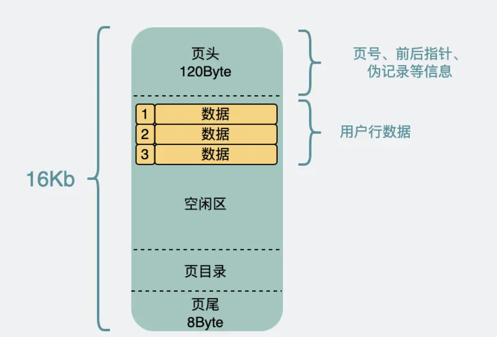
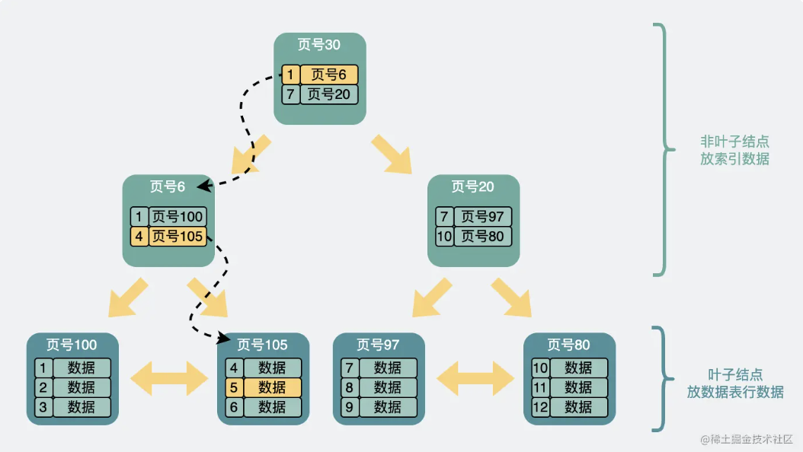
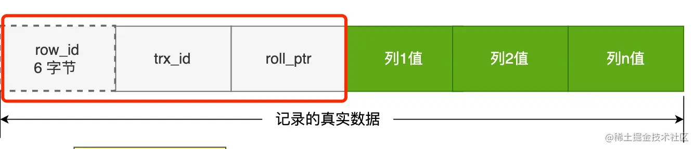
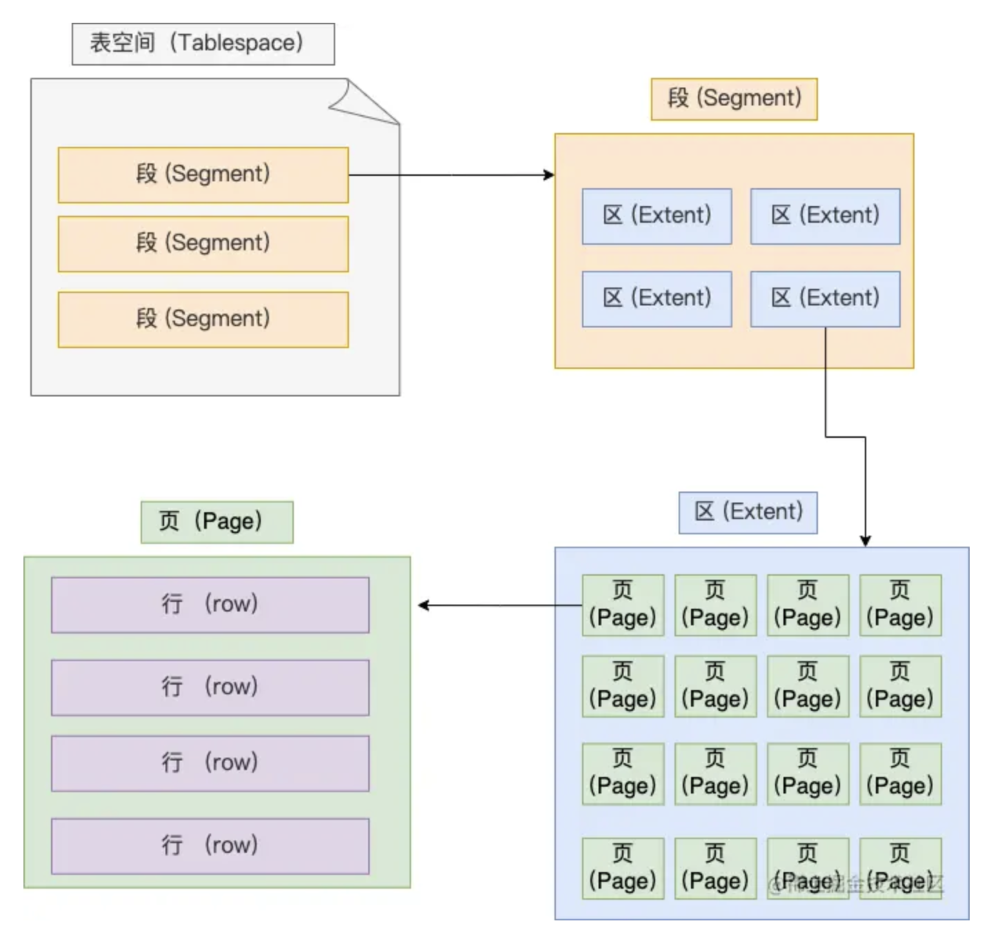
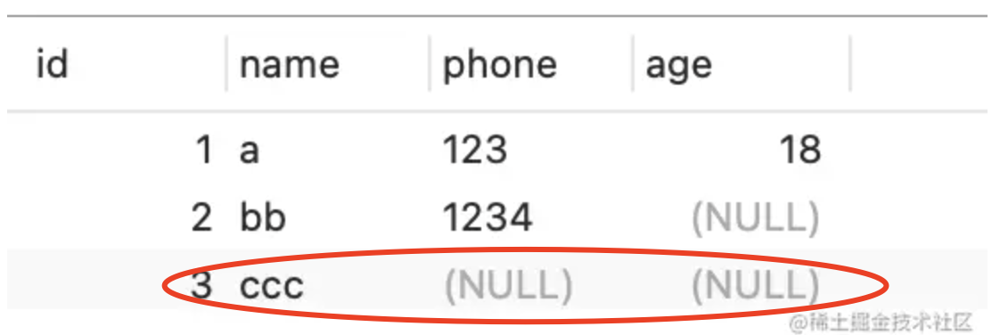
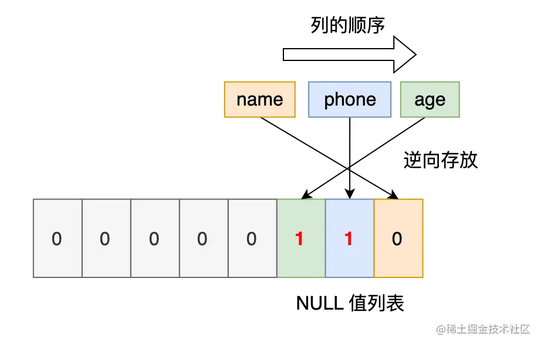

[TOC]

## 一、数据页

首先数据在mysql的Innodb中是按照页进行存储的。

**页** 是InnoDB存储引擎管理数据库的最小磁盘单位，我们常说每个节点16KB，其实就是指每页的大小为16KB。




另外，当新记录插入到 InnoDB 聚集索引中时，InnoDB 会尝试留出 1/16 的页面空闲以供将来插入和更新索引记录。如果按顺序（升序或降序）插入索引记录，则生成的页大约可用 15/16 的空间。如果以随机顺序插入记录，则页大约可用 1/2 到 15/16 的空间。参考文档：[MySQL :: MySQL 5.7 Reference Manual :: 14.6.2.2 The Physical Structure of an InnoDB Index](https://link.juejin.cn?target=https%3A%2F%2Fdev.mysql.com%2Fdoc%2Frefman%2F5.7%2Fen%2Finnodb-physical-structure.html)

除了 `User Records`和`Free Space`  以外所占用的内存是 38+56+26+8=128字节，每一页留给用户数据的空间就还剩 16×(15/16)×1024−128=15232 字节（保留了1/16）。

当然，这是最小值，因为我们没有考虑**页目录**。页目录留在后面根据再去考虑，这个得根据表字段来计算。

## 二、非叶子节点计算

索引页就是存索引的节点，也就是非叶子节点。

每一条索引记录当中都包含了**当前索引的值** 、 **一个 6字节 的指针信息** 、**一个 5 字节的行标头**，用来指向下一层数据页的指针。

> 索引记录当中的指针占用空间我没在官方文档里找到😭，这个 6 字节是我参考其他博文的，他们说源码里写的是6字节，但具体在哪一段源码我也不知道😭。
>
> 希望知道的同学可以在评论区解惑。

假设我们的主键id为 bigint 型，也就是8个字节，那索引页中每行数据占用的空间就等于 8+6+5=19 字节。每页可以存 15232÷19≈801 条索引数据。

那算上页目录的话，按每个槽平均6条数据计算的话, 至少有 801÷6≈134 个槽，需要占用 268 字节的空间。

**ps:页目录是用来存储当中用户数据的位置信息。**

**把存数据的空间分一点给槽的话，我算出来大约可以存 787 条索引数据。**

**如果是主键是 int 型的话，那可以存更多，大约有 993 条索引数据。**

### 前两层非叶子节点计算

在 B+ 树当中，当一个节点索引记录为 N 条时，它就会有 N个子节点。由于我们 3 层B+树的前两层都是索引记录，第一层根节点有 N 条索引记录，那第二层就会有 N个节点，每个节点数据类型与根节点一致，仍然可以再存 N 条记录，第三层的节点个数就会等于N^2。

则有：

- 主键为 bigint 的表可以存放 787^2=619369 个叶子节点
- 主键为 int 的表可以存放993 ^ 2 = 986049  个叶子节点


### 补充：非叶子节点学习

比方说我们想要查找行数据5。会先从顶层页的record们入手。**record里包含了主键id和页号（页地址）** 。看下图黄色的箭头，向左最小id是1，向右最小id是7。那id=5的数据如果存在，那必定在左边箭头。于是顺着的record的页地址就到了6号数据页里，再判断id=5>4，所以肯定在右边的数据页里，于是加载105号数据页。在数据页里找到id=5的数据行，完成查询。




## 三、常规表的存放记录数

大部分情况下我们的表字段都不是上面那样的，所以我选择了一场比较常规的表来进行分析，看看能存放多少数据。表情况如下：

```sql
CREATE TABLE `blog` (
  `id` bigint unsigned NOT NULL AUTO_INCREMENT COMMENT '博客id',
  `author_id` bigint unsigned NOT NULL COMMENT '作者id',
  `title` varchar(50) CHARACTER SET utf8mb4 NOT NULL COMMENT '标题',
  `description` varchar(250) CHARACTER SET utf8mb4 NOT NULL COMMENT '描述',
  `school_code` bigint unsigned DEFAULT NULL COMMENT '院校代码',
  `cover_image` char(32) DEFAULT NULL COMMENT '封面图',
  `create_time` datetime NOT NULL DEFAULT CURRENT_TIMESTAMP COMMENT '创建时间',
  `release_time` datetime DEFAULT NULL COMMENT '首次发表时间',
  `modified_time` datetime NOT NULL DEFAULT CURRENT_TIMESTAMP ON UPDATE CURRENT_TIMESTAMP COMMENT '修改时间',
  `status` tinyint unsigned NOT NULL COMMENT '发表状态',
  `is_delete` tinyint unsigned NOT NULL DEFAULT 0,
  PRIMARY KEY (`id`),
  KEY `author_id` (`author_id`),
  KEY `school_code` (`school_code`) USING BTREE
) ENGINE=InnoDB AUTO_INCREMENT=1 DEFAULT CHARSET=utf8 COLLATE=utf8_general_mysql500_ci ROW_FORMAT=DYNAMIC;
复制代码
```


分析一下这张表的行记录：

Compact 行格式如下


1. 行记录头信息：肯定得有，占用5字节。

2. 可变长度字段列表：表中 `title`占用1字节，`description`占用2字节，共3字节。**(注意：这里是存储长度的值)**

   **可变长度列占用空间计算**：我们创建字段的时候会有varchar(M), 假设字符集中站用一个字符的字节数为W，utf8的占用字节数W为3，gbk一个字符占用字节数为2，ascii占用一个字符的字节数为1。规则如下：

   当M*W<=255时候，存储的都是一个字节数。

   当M*W>255时候:

   ​	如果存储的真实字节长度<127，则用一个字节存储。

   ​	如果存储的真实字节长度>127，则用两个字节存储。

3. null值列表：表中仅`school_code`、`cover_image`、`release_time`3个字段可为null，故仅占用1字节。

4. 事务ID和指针字段：两个都得有，占用13字节。

   - row_id

   如果我们建表的时候指定了主键或者唯一约束列，那么就没有 row_id 隐藏字段了。如果既没有指定主键，又没有唯一约束，那么 InnoDB 就会为记录添加 row_id 隐藏字段。row_id不是必需的，占用 6 个字节。

   - trx_id

   事务id，表示这个数据是由哪个事务生成的。 trx_id是必需的，占用 6 个字节。

   - roll_pointer **mvcc使用**

   这条记录上一个版本的指针。roll_pointer 是必需的，占用 7 个字节。

   

5. 字段内容信息：
   1. `id、author_id、school_code` 均为bigint型，各占用8字节，共24字节。
   2. `create_time、release_time、modified_time` 均为datetime类型，各占8字节，共24字节。
   3. `status、is_delete` 为tinyint类型，各占用1字节，共2字节。
   4. `cover_image` 为char(32)，字符编码为表默认值utf8，由于该字段实际存的内容仅为英文字母（存url的），结合前面讲的*字符编码不同情况下的存储* ，故仅占用32字节。
   5. `title、description` 分别为varchar(50)、varchar(250)，这两个应该都不会产生溢出页（不太确定），字符编码均为utf8mb4，实际生产中70%以上都是存的中文(3字节)，25%为英文(1字节)，还有5%为4字节的表情😁，则存满的情况下将占用 (50+250)×(0.7×3+0.25×1+0.05×4)=765字节。

统计上面的所有分析，共占用 869 字节，则每个叶子节点可以存放 15232÷869≈17 条，算上页目录，仍然能放 17 条。

则三层B+树可以存放的最大数据量就是 17×619369=10,529,273，**约一千万条数据**

### 重点：计算总结

1、首先分两部分计算：记录额外信息和记录真实信息的。

2、其中varchar的是数据可变的，在额外信息记录中会记录对应字段的长度。在真实信息中需要根据字符集来计算具体的字节。例如utf8mb4下 中文(3字节)，英文(1字节)，😊表情（4个字节）。都是中文的话 varchar(50) 就是50*3=150字节

3、单条记录最大是65535字节。但还需要排除额外信息所占用的长度。**一行数据的最大字节数 65535，其实是包含「变长字段长度列表」和 「NULL 值列表」所占用的字节数的**。所以， 我们在算 varchar(n) 中 n 最大值时，需要减去 storage overhead  占用的字节数。

## 四、补充学习：




#### 1、行（row）

数据库表中的记录都是按行（row）进行存放的，每行记录根据不同的行格式，有不同的存储结构。

后面我们详细介绍 InnoDB 存储引擎的行格式，也是本文重点介绍的内容。

#### 2、页（page）

记录是按照行来存储的，但是数据库的读取并不以「行」为单位，否则一次读取（也就是一次 I/O 操作）只能处理一行数据，效率会非常低。

因此，**InnoDB 的数据是按「页」为单位来读写的**，也就是说，当需要读一条记录的时候，并不是将这个行记录从磁盘读出来，而是以页为单位，将其整体读入内存。

**默认每个页的大小为 16KB**，也就是最多能保证 16KB 的连续存储空间。

#### 3、区（extent）

我们知道 InnoDB 存储引擎是用 B+ 树来组织数据的。

B+ 树中每一层都是通过双向链表连接起来的，如果是以页为单位来分配存储空间，那么链表中相邻的两个页之间的物理位置并不是连续的，可能离得非常远，那么磁盘查询时就会有大量的随机I/O，随机 I/O 是非常慢的。

解决这个问题也很简单，就是让链表中相邻的页的物理位置也相邻，这样就可以使用顺序 I/O 了，那么在范围查询（扫描叶子节点）的时候性能就会很高。

那具体怎么解决呢？

**在表中数据量大的时候，为某个索引分配空间的时候就不再按照页为单位分配了，而是按照区（extent）为单位分配。每个区的大小为 1MB，对于  16KB 的页来说，连续的 64 个页会被划为一个区，这样就使得链表中相邻的页的物理位置也相邻，就能使用顺序 I/O 了**。

#### 4、段（segment）

表空间是由各个段（segment）组成的，段是由多个区（extent）组成的。段一般分为数据段、索引段和回滚段等。

- 索引段：存放 B + 树的非叶子节点的区的集合；
- 数据段：存放 B + 树的叶子节点的区的集合；
- 回滚段：存放的是回滚数据的区的集合，之前讲[事务隔离](https://link.juejin.cn?target=https%3A%2F%2Fxiaolincoding.com%2Fmysql%2Ftransaction%2Fmvcc.html)的时候就介绍到了 MVCC 利用了回滚段实现了多版本查询数据。


## 行溢出后，MySQL 是怎么处理的？

MySQL 中磁盘和内存交互的基本单位是页，一个页的大小一般是 `16KB`，也就是 `16384字节`，而一个 varchar(n)  类型的列最多可以存储 `65532字节`，一些大对象如 TEXT、BLOB 可能存储更多的数据，这时一个页可能就存不了一条记录。这个时候就会**发生行溢出，多的数据就会存到另外的「溢出页」中**。

如果一个数据页存不了一条记录，InnoDB 存储引擎会自动将溢出的数据存放到「溢出页」中。在一般情况下，InnoDB 的数据都是存放在 「数据页」中。但是当发生行溢出时，溢出的数据会存放到「溢出页」中。

当发生行溢出时，在记录的真实数据处只会保存该列的一部分数据，而把剩余的数据放在「溢出页」中，然后真实数据处用 **20 字节存储指向溢出页的地址**，从而可以找到剩余数据所在的页。大致如下图所示。


我们定义一个 varchar(65535) 类型的字段，字符集为 ascii 的数据库表。

```sql
CREATE TABLE test ( 
`name` VARCHAR(65535)  NULL
) ENGINE = InnoDB DEFAULT CHARACTER SET = ascii ROW_FORMAT = COMPACT;
复制代码
```

看能不能成功创建一张表：


可以看到，创建失败了。

从报错信息就可以知道**一行数据的最大字节数是 65535（不包含 TEXT、BLOBs 这种大对象类型），其中包含了 storage overhead**。

问题来了，这个 storage overhead 是什么呢？其实就是「变长字段长度列表」和 「NULL 值列表」，也就是说**一行数据的最大字节数 65535，其实是包含「变长字段长度列表」和 「NULL 值列表」所占用的字节数的**。所以， 我们在算 varchar(n) 中 n 最大值时，需要减去 storage overhead  占用的字节数。

这是因为我们存储字段类型为 varchar(n)  的数据时，其实分成了三个部分来存储：

- 真实数据
- 真实数据占用的字节数
- NULL 标识，如果不允许为NULL，这部分不需要

## null值列会被额外标记

​	字段是允许为 NULL 的，所以**会用 1 字节来表示「NULL 值列表」**。


> NULL 值列表」是固定 1 字节空间吗？如果这样的话，一条记录有 9 个字段值都是 NULL，这时候怎么表示？

「NULL 值列表」的空间不是固定 1 字节的。

​	当一条记录有 9 个字段值都是 NULL，那么就会创建 2 字节空间的「NULL 值列表」，以此类推。

## null值列存储

​	**一字节8位，可以标记8个字段是否为null**

​	表中的某些列可能会存储 NULL 值，如果把这些 NULL 值都放到记录的真实数据中会比较浪费空间，所以 Compact 行格式把这些值为 NULL 的列存储到 NULL值列表中。

如果存在允许 NULL 值的列，则每个列对应一个二进制位（bit），二进制位按照列的顺序逆序排列。

- 二进制位的值为`1`时，代表该列的值为NULL。
- 二进制位的值为`0`时，代表该列的值不为NULL。

​	另外，NULL 值列表必须用整数个字节的位表示（1字节8位），如果使用的二进制位个数不足整数个字节，则在字节的高位补 `0`。



InnoDB 是用整数字节的二进制位来表示 NULL 值列表的，现在不足 8 位，所以要在高位补 0，第三条记录 phone 列 和 age 列是 NULL 值，所以，对于第三条数据，NULL 值列表用十六进制表示是 0x06:





> MySQL 的 NULL 值是怎么存放的？

MySQL 的 Compact 行格式中会用「NULL值列表」来标记值为 NULL 的列，NULL 值并不会存储在行格式中的真实数据部分。

NULL值列表会占用 1 字节空间，当表中所有字段都定义成 NOT NULL，行格式中就不会有 NULL值列表，这样可节省 1 字节的空间。


> MySQL 怎么知道 varchar(n) 实际占用数据的大小？

MySQL 的 Compact 行格式中会用「变长字段长度列表」存储变长字段实际占用的数据大小。


> varchar(n) 中 n 最大取值为多少？

**一行记录最大能存储 65535 字节的数据**，但是这个是包含「变长字段字节数列表所占用的字节数」和「NULL值列表所占用的字节数」。所以， 我们在算 varchar(n) 中 n 最大值时，需要减去这两个列表所占用的字节数。

如果一张表只有一个 varchar(n)  字段，且允许为 NULL，字符集为 ascii。varchar(n) 中 n 最大取值为 65532。

计算公式：65535 - 变长字段字节数列表所占用的字节数 - NULL值列表所占用的字节数 = 65535 - 2 - 1 = 65532。

如果有多个字段的话，要保证所有字段的长度 + 变长字段字节数列表所占用的字节数 + NULL值列表所占用的字节数 <= 65535。


> 行溢出后，MySQL 是怎么处理的？

如果一个数据页存不了一条记录，InnoDB 存储引擎会自动将溢出的数据存放到「溢出页」中。

Compact 行格式针对行溢出的处理是这样的：当发生行溢出时，在记录的真实数据处只会保存该列的一部分数据，而把剩余的数据放在「溢出页」中，然后真实数据处用 20 字节存储指向溢出页的地址，从而可以找到剩余数据所在的页。

Compressed 和 Dynamic 这两种格式采用完全的行溢出方式，记录的真实数据处不会存储该列的一部分数据，只存储 20 个字节的指针来指向溢出页。而实际的数据都存储在溢出页中。

